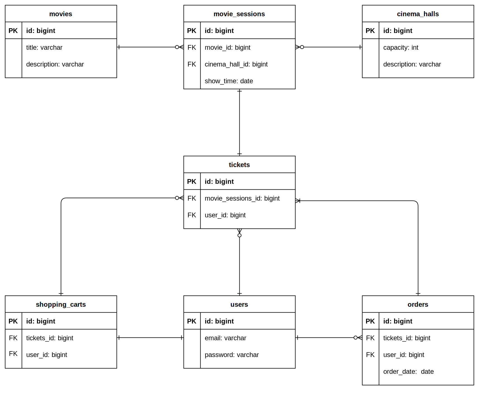

# Ticket shop
## Project description
This is a simple application for managing cinema and selling tickets.
### All features by endpoint with authority
- **[POST]** `/register` - all
- **[GET]** `/cinema-halls` - user/admin
- **[POST]** `/cinema-halls` - admin
- **[GET]** `/movies` - user/admin
- **[POST]** `/movies` - admin
- **[GET]** `/movie-sessions/available` - user/admin
- **[POST]** `/movie-sessions` - admin
- **[PUT]** `/movie-sessions/{id}` - admin
- **[DELETE]** `/movie-sessions/{id}` - admin
- **[GET]** `/orders` - user
- **[POST]** `/orders/complete` - user
- **[PUT]** `/shopping-carts/movie-sessions` - user
- **[GET]** `/shopping-carts/by-user` - user
- **[GET]** `/users/by-email` - admin
### Project created with
- N-layer architecture
  - Presentation layer
  - Business layer
  - Data layer
- SOLID
- REST
### Used technology
- Java 11
- Tomcat 9
- Hibernate 5
- MySQL 8
- Spring 5 
  - Core
  - Security  
  - Web MVC
### How to install
- Install Tomcat 9 (not 10)
- Install MySQL
- Configure Tomcat (root must be "/")
- Set credential for DB in /resources/db.properties
- Run (default user created in DataInitializer.class)
### UML Diagram 

